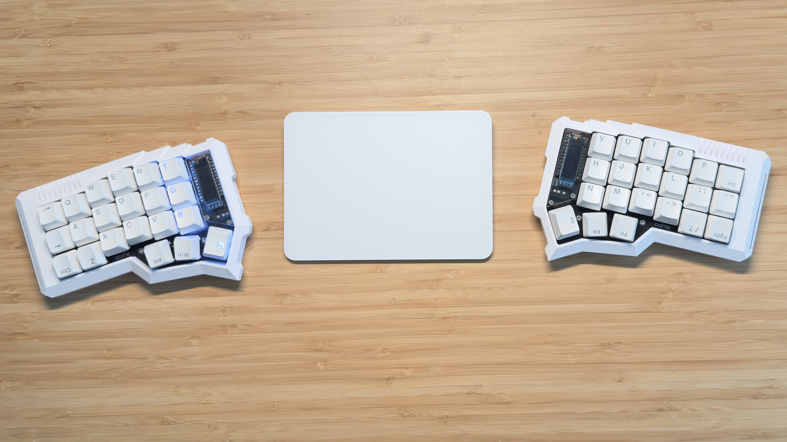

# Corne/CRKBD Case with 14500 Battery Support

A custom 3D-printable case for the Corne/CRKBD keyboard featuring integrated 14500 Li-ion battery support with side-mounting design.

## Features

- ✅ **Corne V2** compatibility
- ✅ **Corne V3** compatibility  
- ✅ **Corne V4** compatibility
- ✅ **14500 Li-ion batteries** (side-mounted design)
- ✅ **Wireless operation** with integrated battery compartment

## Battery Support

This case design has been specifically modified to accommodate **14500 Li-ion batteries** in a **side-mounted configuration**. The battery compartment is integrated into the case design for a clean, professional appearance while maintaining easy access for battery replacement.

### Battery Specifications

- **Battery Type**: 14500 Li-ion (14mm diameter, 50mm length)
- **Mounting**: Side-mounted for optimal space utilization
- **Capacity**: Typically 600-1000mAh depending on battery choice
- **Voltage**: 3.7V nominal

## Files

### Ready to Print

- `version to print v4.stl` - Latest optimized version for 3D printing
- `case2v2_right.stl` - original file version from https://www.thingiverse.com/thing:4283322
- you can mirror the other side during printing process

## Printing Instructions

### Recommended Settings

- Layer height: 0.2mm
- Infill: 20-30%
- Supports: Yes (for battery compartment overhangs)
- Print orientation: Case opening facing up

## Assembly

1. Print both left and right case halves
2. Install your Corne PCB and components
3. Insert 14500 battery into side compartment

## Photos

*Custom Corne case with 14500 battery support*

  
*Detailed view of the battery compartment and case design*

## Safety Notes

- Always use protection circuits with 14500 batteries
- Ensure proper battery polarity during installation
- Monitor battery temperature during charging and use
